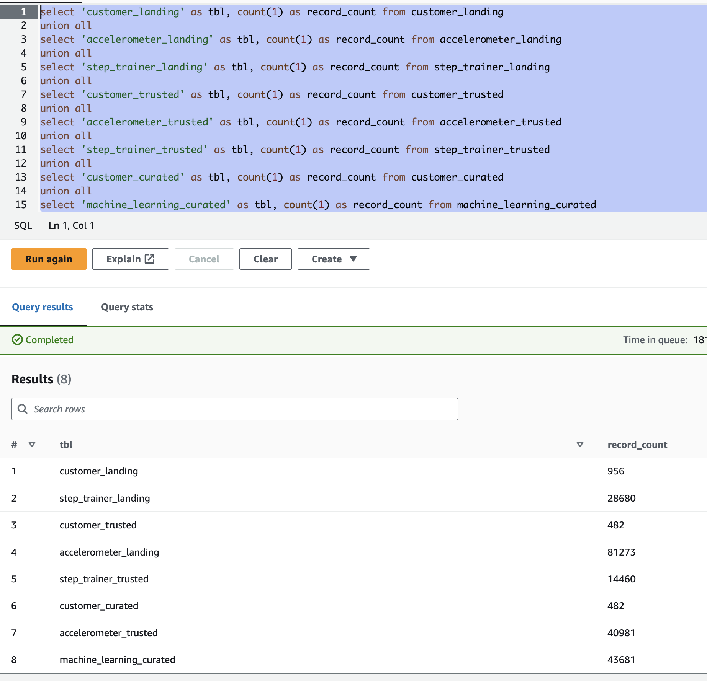
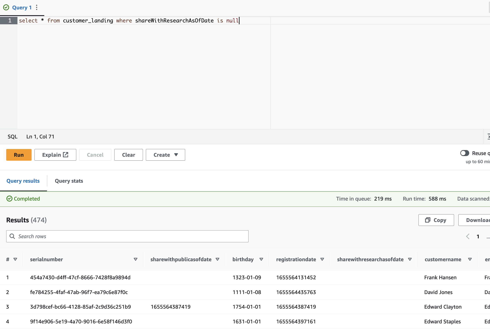
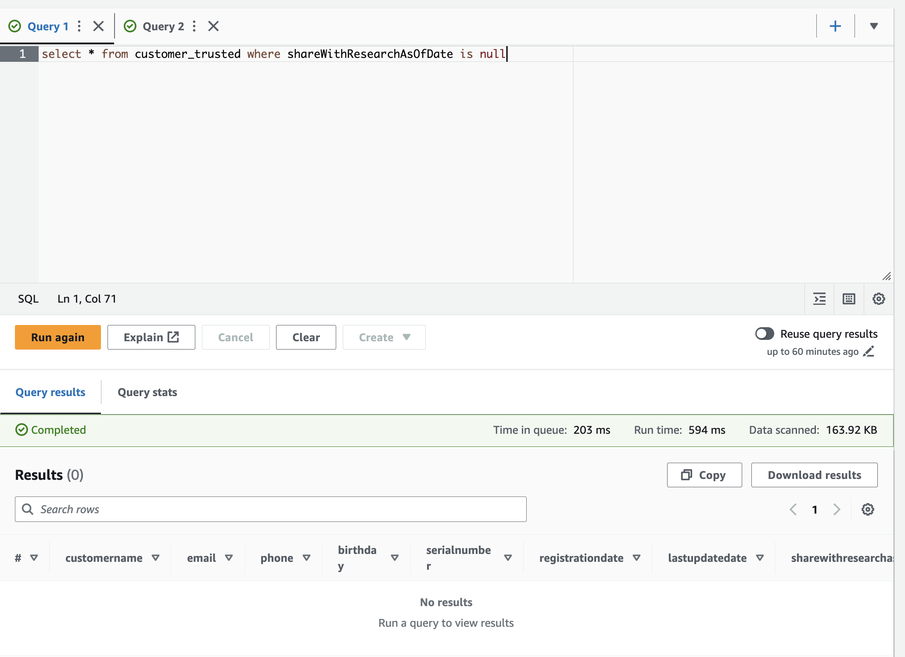
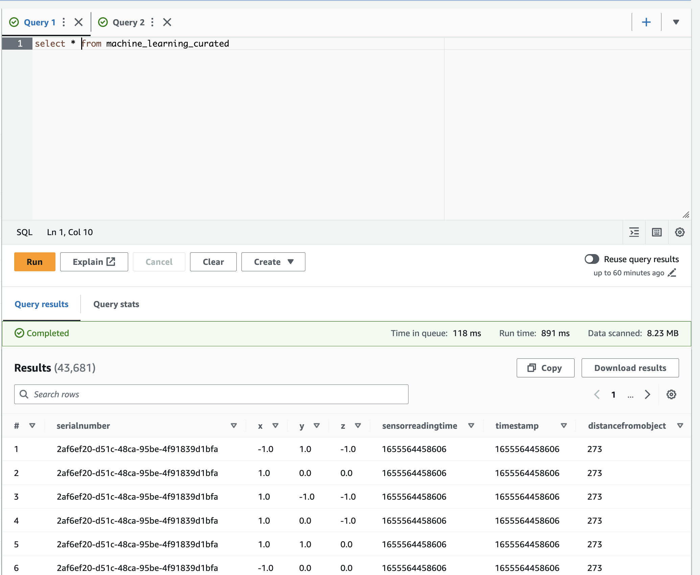

# Data Pipeline Requirement Completion

## Landing Zone

### Success Criteria: Use Glue Studio to Ingest Data from an S3 Bucket

- **Files**: 
  - [customer_landing_to_trusted.py](GlueETL/customer_landing_to_trusted.py)
  - [accelerometer_landing_to_trusted.py](GlueETL/accelerometer_landing_to_trusted.py)
  - [step_trainer_trusted.py](GlueETL/step_trainer_trusted.py)

### Success Criteria: Manually Create a Glue Table using Glue Console from JSON Data

- **Files**: 
  - [customer_landing.sql](GlueDDL/customer_landing.sql)
  - [accelerometer_landing.sql](GlueDDL/accelerometer_landing.sql)
  - [step_trainer_landing.sql](GlueDDL/step_trainer_landing.sql)

### Success Criteria: Use Athena to Query the Landing Zone

> **IMPORTANT NOTE**:  The table counts as of now in the rubric are wrong for `step_trainer_trusted` and `machine_learning_curated`.  Please see [this thread](https://knowledge.udacity.com/questions/1013813) in the knowledge center for more information.  Mentor responsible for the last updated to the rubric said I can submit and reference the thread and confirmed the counts I have are the correct ones.

---

## Trusted Zone

### Success Criteria: Configure Glue Studio to Dynamically Update a Glue Table Schema from JSON Data

- **Files**: 
  - [customer_landing_to_trusted.py](GlueETL/customer_landing_to_trusted.py)
  - [accelerometer_landing_to_trusted.py](GlueETL/accelerometer_landing_to_trusted.py)
  - [step_trainer_trusted.py](GlueETL/step_trainer_trusted.py)
  - [customer_trusted_to_curated.py](GlueETL/customer_trusted_to_curated.py)
  - [machine_learning_curated,py](GlueETL/machine_learning_curated.py)
  
### Success Criteria: Use Athena to Query Trusted Glue Tables

> **IMPORTANT NOTE**:  The table counts as of now in the rubric are wrong for `step_trainer_trusted` and `machine_learning_curated`.  Please see [this thread](https://knowledge.udacity.com/questions/1013813) in the knowledge center for more information.  Mentor responsible for the last updated to the rubric said I can submit and reference the thread and confirmed the counts I have are the correct ones.

### Success Criteria: Join Privacy Tables with Glue Jobs

- **Files**: 
  - [customer_landing_to_trusted.py](GlueETL/customer_landing_to_trusted.py)
  - [accelerometer_landing_to_trusted.py](GlueETL/accelerometer_landing_to_trusted.py)
  - [step_trainer_trusted.py](GlueETL/step_trainer_trusted.py)
  - [customer_trusted_to_curated.py](GlueETL/customer_trusted_to_curated.py)
  - [machine_learning_curated,py](GlueETL/machine_learning_curated.py)
  
### Success Criteria: Filter Protected PII with Spark in Glue Jobs

- **Files**: 
  - [customer_landing_to_trusted.py](GlueETL/customer_landing_to_trusted.py)
  - [accelerometer_landing_to_trusted.py](GlueETL/accelerometer_landing_to_trusted.py)
  - [step_trainer_trusted.py](GlueETL/step_trainer_trusted.py)
  - [customer_trusted_to_curated.py](GlueETL/customer_trusted_to_curated.py)
  - [machine_learning_curated,py](GlueETL/machine_learning_curated.py)
  
---

## Curated Zone

### Success Criteria: Write a Glue Job to Join Trusted Data

- **File**: [customer_trusted_to_curated.py](GlueETL/customer_trusted_to_curated.py)

### Success Criteria: Write a Glue Job to Create Curated Data

- **Files**:
  - [customer_trusted_to_curated.py](GlueETL/customer_trusted_to_curated.py)
  - [machine_learning_curated,py](GlueETL/machine_learning_curated.py)
  
### Success Criteria: Use Athena to Query Curated Glue Tables

> **IMPORTANT NOTE**:  The table counts as of now in the rubric are wrong for `step_trainer_trusted` and `machine_learning_curated`.  Please see [this thread](https://knowledge.udacity.com/questions/1013813) in the knowledge center for more information.  Mentor responsible for the last updated to the rubric said I can submit and reference the thread and confirmed the counts I have are the correct ones.

